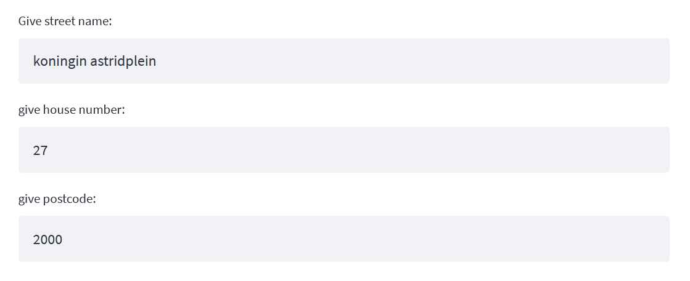
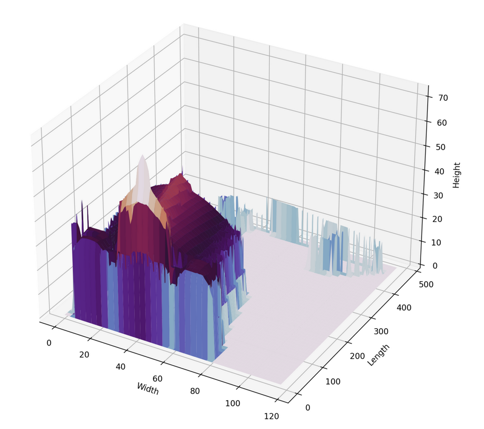
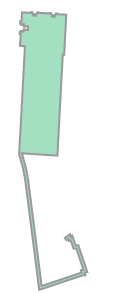
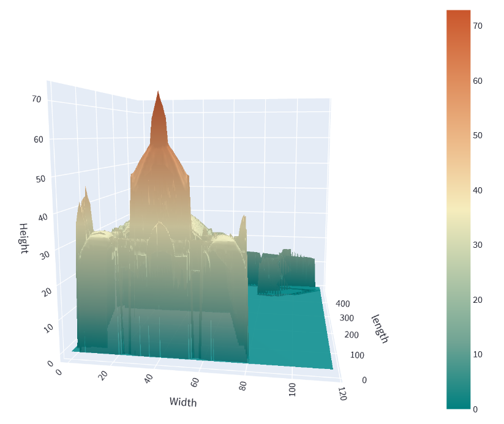

# 3D House Project

## The Mission
We are LIDAR PLANES, active in the Geospatial industry. We would like to use our data to launch a new branch in the insurance business.  
So, we need you to build a solution with our data to model a house in 3D with only a home address.

### for this project I was:
- able to search and implement new libraries
- able to read and use the shapefile format
- able to read and use geoTIFFs
- able to render a 3D plot
- able to deploy it on streamlit

## Terms you need to know

**LIDAR** is a method to measure distance using light. The device will illuminate a target with a laser light and a sensor will measure the reflection.   
Differences in wavelenght and return times will be used to get the 3D representations of an area. 

**Digital Surface Model (DSM)** includes ground surface, vegetation and man-made objects. DSM demonstrate the natural and artificial features on the Earth’s surface.   
DSM may be useful for RF planning, landscape modelling, city modelling, visualization applications and more. 

**Digital Terrain Model (DTM)** is often required for flood or ground rupture modeling, land-use studies, geological analysis DSM demonstrate the natural and  
artificial features on the Earth’s surface. 

**Canopy Height Model (CHM)** is the height or residual distance between the ground and the top of the of objects above the ground.  
This includes the actual heights of trees, builds and any other objects on the earth's surface. The CHM is created by subtracting the DTM from the DSM. 


## Repo Architecture 

```
|   .gitignore
|   bounding_box.csv
|   create_csv_bounds.ipynb
|   main.py
|   OOP_3d_House.ipynb
|   README.md
|   requirements.txt
|
+---Adress
|       Adress.py
|
\---Assets
        cat-typing.gif
        go_plot.PNG
        pyplot.PNG
        shapely_polygon.PNG
        user_input.PNG

```
# Installation
- Clone this repository into your local environment with below command-

  `git clone https://github.com/ujjwalk00/3D_Houses.git`

- Create python virtual environment

- Install all the required library with below command

  `pip install -r requirements.txt`

# Usage

To run application with streamlit run main.py with below command.

  `streamlit run main.py`

Application will open in browser automatically or you can also find application url in terminal like below


# Demo
After running the main.py file you will be directed to the streamlit web app where you can see user inputs for streetname,house number and zip code. 



Next we wait until the Canopy Height Model is calculated, because we are extracting DSM and DTM from web, based on the location we give as an input it take a lot of time.  
There is also a csv file called bounding_box where we store url of the tiff files based on the limit of X and Y coordinate. When the user gives an location, our program searches for  
the right tiff file url that fits with within the value of the coordinates of the location and the bounding box. It takes on average 6 minutes because it reads the data without  
downloading the tiff file .If you wish to make this program operate faster you could download every tiff files of [dsm](geopunt.be/download?container=dhm-vlaanderen-ii-dsm-raster-1m&title=Digitaal%20Hoogtemodel%20Vlaanderen%20II,%20DSM,%20raster,%201m)
 and [dtm](https://www.geopunt.be/download?container=dhm-vlaanderen-ii-dtm-raster-1m&title=Digitaal%20Hoogtemodel%20Vlaanderen%20II,%20DTM,%20raster,%201m)
 from Flanders and read the data from local files  
but make sure you have enough disk memory because. After the chm is calculated we get to see the 3D model.




Shapely Polygon enabled us to filter out other surrounding such as plants,trees,rocks,ect...  




It's the blueprint we provide to the algorithm so we get a clean 3D model. As you can see we have a 3D model of given location but there are a lot of noise and not visually  
attractive Well there is a better alternative to plot our 3D model, plotly's Python graphing library allows us to make interactive, publication-quality graphs, have a look at the difference.





# Timeline
*November 2021*

Time limit: 2 weeks


# Personal situation

I am currently consolidating the knowledge in Python specifically in `Numpy, Pandas` and `Matplotlib`  
This is a group project given to us at [BeCode](https://becode.org/)  
Here is how you can contact me :

[Ujjwal Kandel](https://www.linkedin.com/in/ujjwal-kandel-10743a1bb/)

ujjwalkandel2000@gmail.com


## Good Luck!
